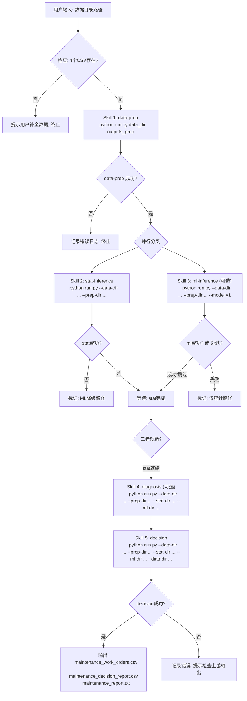

# 预测性维护推理技能系统 —— 开发与使用指南（第二版）

## 系统概述

本系统将 100 台 CNC 机床的原始监测数据（4 项参数：电压、电流、温度、转子转速）转化为按优先级排序、有成本依据的维护工单。5 个技能组成推理流水线，每个技能自包含（SKILL.md + scripts/），上下游通过 CSV 文件传递数据，Agent 按 DAG 调度执行。

**核心论断**：仅凭电压、电流、温度三项参数（转子转速已排除），系统以 z-score 基线实现故障检出率 84%、误报率 20%。能力上限由传感器决定（Youden's J = 0.075），非模型架构可突破。

**适用场景**：
- 新建文件夹只有 4 个原始 CSV，通过 5 技能调用完成全流程分析
- Agent 自动编排多技能并行/串行执行
- MCP 适配层将推理能力暴露为标准化 Tool/Resource 接口

---

## 第 1 章：技能清单与数据流

### 1.1 五个技能概览

| 序号 | 技能名 | 职责 | 输入 | 输出 | 执行时间 |
|---|---|---|---|---|---|
| 1 | data-prep | 加载数据、构建基线、z-score、成本矩阵 | 4 CSV 文件 | 10 个 CSV/JSON | ~5s |
| 2 | stat-inference | z-score 评估、T2 统计、故障签名、告警汇总 | data-prep 输出 | alert_summary.csv 等 | ~3s |
| 3 | ml-inference | XGBoost/MTNN 训练、故障密度预测 | data-prep 输出 + 原始数据 | prediction_report.csv | ~30s(v1)/~5min(v2) |
| 4 | diagnosis | 异常模式识别、5 维度可预测性分析 | stat + ml 输出 | diagnosis_report.csv | ~2s |
| 5 | decision | 多信号融合、动作推荐、工单生成 | 全部上游输出 | maintenance_work_orders.csv | ~1s |

### 1.2 数据流

```
┌──────────────────────────────────────────────────────────────┐
│                        原始数据集                              │
│  MACHINE_LOG_DATA._2025.csv                                  │
│  MACHINE_SUMMARY_DATA._2025.csv                              │
│  PRODUCT_ASSEMBLY_LINE_WITH_MACHINES_2025.csv                │
│  PRODUCT_ASSEMBLY_LINE_WITH_MACHINES_TESTS_2025.csv          │
└────────────┬─────────────────────────────────────────────────┘
             │
             ▼
┌────────────────────────┐
│   Skill 1: data-prep   │  run.py <data_dir> <output_dir>
│   baseline_analysis.py │
└────────┬───────────────┘
         │ z_scores.csv, cost_risk_matrix.csv, baseline_stats.csv,
         │ failure_signatures.csv, variance_decomposition.csv,
         │ machine_clusters.csv, hotelling_t2.csv, manifest.json
         │
         ├──────────────────────────────────┐
         ▼                                  ▼
┌──────────────────────────┐  ┌──────────────────────────┐
│  Skill 2: stat-inference │  │  Skill 3: ml-inference    │
│  run.py                  │  │  run.py --model v1        │
│  (并行执行)               │  │  (并行执行)               │
└──────────┬───────────────┘  └──────────┬───────────────┘
           │ alert_summary.csv,          │ prediction_report.csv
           │ z_threshold_sweep.csv,      │
           │ stat_inference_summary.json │
           │                             │
           └──────────┬──────────────────┘
                      ▼
         ┌────────────────────────┐
         │  Skill 4: diagnosis    │  run.py
         │  (可选，增强诊断)       │
         └──────────┬─────────────┘
                    │ diagnosis_report.csv
                    ▼
         ┌────────────────────────┐
         │  Skill 5: decision     │  run.py
         │  4层决策引擎            │
         └──────────┬─────────────┘
                    │ maintenance_work_orders.csv (最终产物)
                    │ maintenance_decision_report.csv
                    │ maintenance_report.txt
                    ▼
              运维人员 / 上层系统
```

---

## 第 2 章：Agent 调度流程图

### 2.1 完整 DAG 调度流程（Mermaid）



### 2.2 降级路径（无 ML）


当 ML 环境不可用（无 PyTorch/XGBoost）或用户指定 `--skip-ml` 时，Agent 自动走降级路径。ML 信号权重仅 0.25，决策稳定性不受影响。

### 2.3 Agent 调度状态机

```
                    ┌─────────┐
                    │  IDLE   │
                    └────┬────┘
                         │ receive_task(data_dir)
                         ▼
                    ┌─────────┐
                    │ VALIDATE│──── 数据不全 ──► ERROR
                    └────┬────┘
                         │ 4 CSVs OK
                         ▼
                    ┌─────────┐
                    │PREP_RUN │ Skill 1 执行中
                    └────┬────┘
                         │ manifest.json 生成
                         ▼
              ┌─────────────────────┐
              │   FORK              │
              │  ├─ STAT_RUN        │ Skill 2
              │  └─ ML_RUN (可选)   │ Skill 3
              └────────┬────────────┘
                       │ 两者完成(或 ml 跳过)
                       ▼
              ┌─────────────────────┐
              │   DIAG_RUN (可选)    │ Skill 4
              └────────┬────────────┘
                       │
                       ▼
              ┌─────────────────────┐
              │   DECIDE_RUN        │ Skill 5
              └────────┬────────────┘
                       │ work_orders 生成
                       ▼
              ┌─────────────────────┐
              │   COMPLETE          │
              └─────────────────────┘
```

---

## 第 3 章：端到端可运行 Agent 脚本

将以下脚本保存为 `agent_orchestrator.py`，放在 skills 目录下。它实现完整的 Agent 调度逻辑：校验输入 → 串行 data-prep → 并行 stat+ml → 串行 diagnosis → 串行 decision → 输出结果。

```python
#!/usr/bin/env python3
"""
预测性维护 Agent 编排器 (Agent Orchestrator)
==============================================
完整的端到端调度脚本：按 DAG 依次调用 5 个技能，
自动处理降级、错误恢复、进度追踪。

用法:
    python agent_orchestrator.py --data-dir <原始CSV目录> --output-dir <输出目录>
    python agent_orchestrator.py --data-dir <原始CSV目录> --skip-ml --skip-diagnosis
    python agent_orchestrator.py --data-dir <原始CSV目录> --model v2 --streaming

依赖: Python 3.8+, pandas, numpy, scipy, scikit-learn
可选: xgboost (v1), pytorch (v2)
"""

import sys, os, json, argparse, subprocess, time, shutil
from pathlib import Path
from datetime import datetime
from concurrent.futures import ThreadPoolExecutor, as_completed
from dataclasses import dataclass, field
from typing import List, Dict, Optional, Tuple
from enum import Enum


# ==============================================================================
# Configuration
# ==============================================================================

# 技能目录：本脚本所在目录下的 5 个技能子目录
SKILLS_BASE = Path(__file__).resolve().parent

SKILLS = {
    "data_prep": {
        "dir": SKILLS_BASE / "predictive-maintenance-data-prep",
        "script": "scripts/run.py",
        "required": True,
        "depends_on": [],
    },
    "stat_inference": {
        "dir": SKILLS_BASE / "predictive-maintenance-stat-inference",
        "script": "scripts/run.py",
        "required": True,
        "depends_on": ["data_prep"],
    },
    "ml_inference": {
        "dir": SKILLS_BASE / "predictive-maintenance-ml-inference",
        "script": "scripts/run.py",
        "required": False,  # 可选
        "depends_on": ["data_prep"],
    },
    "diagnosis": {
        "dir": SKILLS_BASE / "predictive-maintenance-diagnosis",
        "script": "scripts/run.py",
        "required": False,  # 可选
        "depends_on": ["data_prep", "stat_inference", "ml_inference"],
    },
    "decision": {
        "dir": SKILLS_BASE / "predictive-maintenance-decision",
        "script": "scripts/run.py",
        "required": True,
        "depends_on": ["data_prep", "stat_inference", "ml_inference", "diagnosis"],
    },
}

REQUIRED_FILES = [
    "MACHINE_LOG_DATA._2025.csv",
    "MACHINE_SUMMARY_DATA._2025.csv",
    "PRODUCT_ASSEMBLY_LINE_WITH_MACHINES_2025.csv",
    "PRODUCT_ASSEMBLY_LINE_WITH_MACHINES_TESTS_2025.csv",
]


# ==============================================================================
# Data Structures
# ==============================================================================

class StepStatus(Enum):
    PENDING = "pending"
    RUNNING = "running"
    SUCCESS = "success"
    FAILED = "failed"
    SKIPPED = "skipped"


@dataclass
class StepResult:
    skill_name: str
    status: StepStatus
    output_dir: str = ""
    duration_seconds: float = 0.0
    error_message: str = ""
    stdout: str = ""
    stderr: str = ""


@dataclass
class PipelineResult:
    steps: List[StepResult] = field(default_factory=list)
    start_time: str = ""
    end_time: str = ""
    total_duration: float = 0.0
    final_output_dir: str = ""
    work_orders_count: int = 0
    summary: dict = field(default_factory=dict)


# ==============================================================================
# Agent Orchestrator
# ==============================================================================

class PredictiveMaintenanceAgent:
    """
    预测性维护 Agent —— 编排 5 个技能的 DAG 执行。

    Features:
      - 输入校验（4 个 CSV 必须存在）
      - DAG 拓扑排序执行
      - stat-inference 与 ml-inference 并行调度
      - ML 不可用时自动降级
      - 进度追踪与错误恢复
      - 最终输出汇总
    """

    def __init__(self, data_dir: str, output_base: str,
                 skip_ml: bool = False, skip_diagnosis: bool = False,
                 model_version: str = "v1", streaming: bool = False,
                 max_orders: int = 20):
        self.data_dir = Path(data_dir).resolve()
        self.output_base = Path(output_base).resolve()
        self.skip_ml = skip_ml
        self.skip_diagnosis = skip_diagnosis
        self.model_version = model_version
        self.streaming = streaming
        self.max_orders = max_orders

        # 每个技能的输出目录
        self.output_dirs: Dict[str, Path] = {}
        self.results: List[StepResult] = []

        # 验证
        self._validate_input()

    def _validate_input(self):
        """检查原始数据目录是否包含全部 4 个 CSV 文件。"""
        print("=" * 60)
        print("[VALIDATE] Checking input data directory...")
        print(f"  Path: {self.data_dir}")
        missing = []
        for fname in REQUIRED_FILES:
            fpath = self.data_dir / fname
            exists = fpath.exists()
            print(f"  {'[OK]' if exists else '[MISSING]'} {fname}")
            if not exists:
                missing.append(fname)

        if missing:
            raise FileNotFoundError(
                f"Missing {len(missing)} required file(s): {missing}\n"
                f"Please ensure all 4 CSV files are in: {self.data_dir}"
            )
        print("  All required files present.\n")

    def _run_skill(self, skill_key: str, extra_args: List[str] = None) -> StepResult:
        """执行单个技能的 run.py 脚本。"""
        skill = SKILLS[skill_key]
        skill_dir = skill["dir"]
        script_path = skill_dir / skill["script"]

        if not script_path.exists():
            return StepResult(
                skill_name=skill_key,
                status=StepStatus.FAILED,
                error_message=f"Script not found: {script_path}"
            )

        output_dir = self.output_base / f"output_{skill_key}"
        output_dir.mkdir(parents=True, exist_ok=True)
        self.output_dirs[skill_key] = output_dir

        # 构建命令行参数
        cmd = [sys.executable, str(script_path)]

        if skill_key == "data_prep":
            cmd.extend([str(self.data_dir), str(output_dir)])
        else:
            cmd.extend(["--data-dir", str(self.data_dir)])
            cmd.extend(["--output-dir", str(output_dir)])

            # 根据技能传递上游输出目录
            if "data_prep" in skill["depends_on"] and "data_prep" in self.output_dirs:
                cmd.extend(["--prep-dir", str(self.output_dirs["data_prep"])])
            if "stat_inference" in skill["depends_on"] and "stat_inference" in self.output_dirs:
                cmd.extend(["--stat-dir", str(self.output_dirs["stat_inference"])])
            if "ml_inference" in skill["depends_on"] and "ml_inference" in self.output_dirs:
                cmd.extend(["--ml-dir", str(self.output_dirs["ml_inference"])])
            if "diagnosis" in skill["depends_on"] and "diagnosis" in self.output_dirs:
                cmd.extend(["--diag-dir", str(self.output_dirs["diagnosis"])])

        if skill_key == "ml_inference":
            cmd.extend(["--model", self.model_version])
        if skill_key == "decision":
            if self.streaming:
                cmd.append("--streaming")
            cmd.extend(["--max-orders", str(self.max_orders)])

        if extra_args:
            cmd.extend(extra_args)

        print(f"[RUN] {skill_key}")
        print(f"  Command: {' '.join(cmd)}")

        start = time.time()
        try:
            result = subprocess.run(
                cmd,
                cwd=str(skill_dir),
                capture_output=True,
                text=True,
                timeout=600,  # 10 分钟超时
            )
            duration = time.time() - start

            step = StepResult(
                skill_name=skill_key,
                status=StepStatus.SUCCESS if result.returncode == 0 else StepStatus.FAILED,
                output_dir=str(output_dir),
                duration_seconds=duration,
                stdout=result.stdout,
                stderr=result.stderr,
                error_message="" if result.returncode == 0 else f"Exit code: {result.returncode}",
            )

            # 打印摘要
            if result.returncode == 0:
                # 提取最后几行关键输出
                lines = result.stdout.strip().split("\n")
                for line in lines[-8:]:
                    if line.strip():
                        print(f"  {line}")
                print(f"  [OK] {skill_key} completed in {duration:.1f}s")
            else:
                print(f"  [FAIL] {skill_key} failed (exit {result.returncode})")
                # 打印错误尾部
                stderr_lines = result.stderr.strip().split("\n")
                for line in stderr_lines[-5:]:
                    if line.strip():
                        print(f"  STDERR: {line}")

            return step

        except subprocess.TimeoutExpired:
            duration = time.time() - start
            print(f"  [TIMEOUT] {skill_key} exceeded 600s limit")
            return StepResult(
                skill_name=skill_key,
                status=StepStatus.FAILED,
                output_dir=str(output_dir),
                duration_seconds=duration,
                error_message="Timeout after 600 seconds",
            )

    def run(self) -> PipelineResult:
        """
        按 DAG 拓扑顺序执行流水线。

        DAG:
          data_prep ──┬── stat_inference ──┬── diagnosis ── decision
                       └── ml_inference ───┘
        """
        pipeline_start = time.time()
        result = PipelineResult(
            start_time=datetime.now().isoformat(),
        )

        print("=" * 60)
        print("Predictive Maintenance Agent — Pipeline Orchestrator")
        print("=" * 60)
        print(f"Data dir:     {self.data_dir}")
        print(f"Output base:  {self.output_base}")
        print(f"Skip ML:      {self.skip_ml}")
        print(f"Skip Diag:    {self.skip_diagnosis}")
        print(f"Model:        {self.model_version}")
        print(f"Streaming:    {self.streaming}")
        print()

        # ── Phase 1: Data Preparation (serial, blocking) ──
        print("─" * 40)
        print("Phase 1/4: Data Preparation")
        print("─" * 40)
        step = self._run_skill("data_prep")
        self.results.append(step)
        if step.status != StepStatus.SUCCESS:
            print("[ABORT] data-prep failed. Pipeline cannot continue.")
            result.steps = self.results
            return result

        # ── Phase 2: Inference (parallel: stat + ml) ──
        print("\n─" * 40)
        print("Phase 2/4: Inference (parallel)")
        print("─" * 40)

        parallel_tasks = ["stat_inference"]  # stat 必须执行
        if not self.skip_ml:
            # 检查 ML 依赖是否可用
            ml_available = self._check_ml_deps()
            if ml_available:
                parallel_tasks.append("ml_inference")
            else:
                print("[FALLBACK] ML dependencies not available. Using stat-only path.")
                step = StepResult(
                    skill_name="ml_inference",
                    status=StepStatus.SKIPPED,
                    error_message="ML dependencies not installed (xgboost/torch)",
                )
                self.results.append(step)

        # 并行执行
        with ThreadPoolExecutor(max_workers=2) as executor:
            futures = {
                executor.submit(self._run_skill, task): task
                for task in parallel_tasks
            }
            for future in as_completed(futures):
                step = future.result()
                self.results.append(step)

        # 检查 stat 是否成功
        stat_step = next((r for r in self.results if r.skill_name == "stat_inference"), None)
        if not stat_step or stat_step.status != StepStatus.SUCCESS:
            print("[ABORT] stat-inference failed. Pipeline cannot continue.")
            result.steps = self.results
            return result

        # ── Phase 3: Diagnosis (serial, optional) ──
        if not self.skip_diagnosis:
            print("\n─" * 40)
            print("Phase 3/4: Diagnosis")
            print("─" * 40)
            step = self._run_skill("diagnosis")
            self.results.append(step)

        # ── Phase 4: Decision (serial, required) ──
        print("\n─" * 40)
        print("Phase 4/4: Decision Engine")
        print("─" * 40)
        step = self._run_skill("decision")
        self.results.append(step)

        # ── Finalize ──
        result.steps = self.results
        result.end_time = datetime.now().isoformat()
        result.total_duration = time.time() - pipeline_start
        result.final_output_dir = str(self.output_dirs.get("decision", ""))

        # 获取工单数量
        wo_path = Path(result.final_output_dir) / "maintenance_work_orders.csv"
        if wo_path.exists():
            import pandas as pd
            try:
                wo_df = pd.read_csv(wo_path)
                result.work_orders_count = len(wo_df)
            except Exception:
                result.work_orders_count = -1

        # 构建摘要
        result.summary = self._build_summary(result)

        self._print_summary(result)
        return result

    def _check_ml_deps(self) -> bool:
        """检查 ML 依赖是否可用。"""
        try:
            import numpy as np
            try:
                import xgboost
                return True
            except ImportError:
                pass
            try:
                import torch
                return True
            except ImportError:
                pass
            return False
        except ImportError:
            return False

    def _build_summary(self, result: PipelineResult) -> dict:
        """构建流水线执行摘要。"""
        statuses = {r.skill_name: r.status.value for r in result.steps}
        durations = {r.skill_name: round(r.duration_seconds, 1) for r in result.steps}

        # 读取 decision_summary.json
        decision_summary = {}
        ds_path = Path(result.final_output_dir) / "decision_summary.json"
        if ds_path.exists():
            with open(ds_path) as f:
                decision_summary = json.load(f)

        return {
            "pipeline_status": "complete" if all(
                r.status in (StepStatus.SUCCESS, StepStatus.SKIPPED)
                for r in result.steps
            ) else "partial",
            "step_statuses": statuses,
            "step_durations_seconds": durations,
            "total_duration_seconds": round(result.total_duration, 1),
            "work_orders_count": result.work_orders_count,
            "decision_summary": decision_summary,
        }

    def _print_summary(self, result: PipelineResult):
        """打印流水线执行报告。"""
        print("\n")
        print("=" * 60)
        print("PIPELINE EXECUTION REPORT")
        print("=" * 60)
        print(f"Start:  {result.start_time}")
        print(f"End:    {result.end_time}")
        print(f"Total:  {result.total_duration:.1f}s")
        print()

        for r in result.steps:
            icon = {
                StepStatus.SUCCESS: "[OK]",
                StepStatus.FAILED: "[FAIL]",
                StepStatus.SKIPPED: "[SKIP]",
                StepStatus.PENDING: "[...]",
                StepStatus.RUNNING: "[RUN]",
            }.get(r.status, "[??]")
            print(f"  {icon} {r.skill_name:<25s} {r.duration_seconds:>6.1f}s  → {r.output_dir}")
            if r.error_message:
                print(f"       Error: {r.error_message}")

        print()
        print(f"Work orders generated: {result.work_orders_count}")
        print(f"Final output: {result.final_output_dir}")
        print("=" * 60)


# ==============================================================================
# CLI Entry Point
# ==============================================================================

def main():
    parser = argparse.ArgumentParser(
        description="Predictive Maintenance Agent Orchestrator",
        formatter_class=argparse.RawDescriptionHelpFormatter,
        epilog="""
Examples:
  # 完整 5 技能流水线
  python agent_orchestrator.py --data-dir /data/raw_csvs --output-dir outputs

  # 跳过 ML（降级路径，3 步产出工单）
  python agent_orchestrator.py --data-dir /data/raw_csvs --skip-ml --skip-diagnosis

  # 使用 v2 神经网络 + 流式模式
  python agent_orchestrator.py --data-dir /data/raw_csvs --model v2 --streaming
        """,
    )
    parser.add_argument("--data-dir", required=True,
                        help="Directory containing 4 raw CSV files")
    parser.add_argument("--output-dir", default="outputs",
                        help="Base directory for all outputs")
    parser.add_argument("--skip-ml", action="store_true",
                        help="Skip ML inference (use stat-only path)")
    parser.add_argument("--skip-diagnosis", action="store_true",
                        help="Skip anomaly diagnosis step")
    parser.add_argument("--model", choices=["v1", "v2"], default="v1",
                        help="ML model version (default: v1 XGBoost)")
    parser.add_argument("--streaming", action="store_true",
                        help="Enable continuous confirmation in decision engine")
    parser.add_argument("--max-orders", type=int, default=20,
                        help="Max work orders per cycle (default: 20)")
    args = parser.parse_args()

    # 创建并运行 Agent
    agent = PredictiveMaintenanceAgent(
        data_dir=args.data_dir,
        output_base=args.output_dir,
        skip_ml=args.skip_ml,
        skip_diagnosis=args.skip_diagnosis,
        model_version=args.model,
        streaming=args.streaming,
        max_orders=args.max_orders,
    )

    result = agent.run()

    # 保存执行报告
    report_path = Path(args.output_dir) / "pipeline_execution_report.json"
    report_path.parent.mkdir(parents=True, exist_ok=True)
    with open(report_path, "w") as f:
        json.dump(result.summary, f, indent=2, ensure_ascii=False)
    print(f"\nExecution report saved to: {report_path}")

    # 返回状态码
    if result.summary.get("pipeline_status") == "complete":
        return 0
    else:
        return 1


if __name__ == "__main__":
    sys.exit(main())
```

### 3.1 Agent 脚本使用示例

```bash
# 放在 skills 目录下
cd /path/to/skills/

# 完整流水线（含 ML）
python agent_orchestrator.py \
  --data-dir /path/to/raw_csvs/ \
  --output-dir outputs_full

# 降级路径（仅统计，3 步）
python agent_orchestrator.py \
  --data-dir /path/to/raw_csvs/ \
  --output-dir outputs_quick \
  --skip-ml --skip-diagnosis

# 使用 v2 神经网络 + 流式确认
python agent_orchestrator.py \
  --data-dir /path/to/raw_csvs/ \
  --output-dir outputs_v2 \
  --model v2 --streaming
```

### 3.2 输出目录结构

```
outputs_full/
├── pipeline_execution_report.json  # 执行报告（新增）
├── output_data_prep/
│   ├── z_scores.csv
│   ├── cost_risk_matrix.csv
│   ├── manifest.json
│   └── ...
├── output_stat_inference/
│   ├── alert_summary.csv
│   ├── manifest.json
│   └── ...
├── output_ml_inference/
│   ├── prediction_report.csv
│   └── ...
├── output_diagnosis/
│   ├── diagnosis_report.csv
│   └── ...
└── output_decision/
    ├── maintenance_work_orders.csv       ← 最终产物
    ├── maintenance_decision_report.csv
    ├── maintenance_report.txt
    └── decision_summary.json
```

---

## 第 4 章：Agent 调度伪代码

```python
def agent_predictive_maintenance(data_dir: str, skip_ml: bool = False):
    """
    Agent 主入口：接收数据目录，返回工单列表。
    此函数可在 MCP Tool 或 API 端点中直接调用。
    """
    # 1. 校验
    validate_input_files(data_dir)

    # 2. Phase 1: 数据准备
    prep_outputs = run_skill("data-prep", data_dir=data_dir)
    if not prep_outputs.success:
        raise PipelineError("Data preparation failed")

    # 3. Phase 2: 并行推理
    with parallel():
        stat_future = submit(run_skill, "stat-inference",
                             prep_dir=prep_outputs.dir)
        ml_future = submit(run_skill, "ml-inference",
                           prep_dir=prep_outputs.dir) if not skip_ml else None
        stat_outputs = stat_future.result()
        ml_outputs = ml_future.result() if ml_future else None

    # 4. Phase 3: 诊断（可选）
    diag_outputs = run_skill("diagnosis",
                             prep_dir=prep_outputs.dir,
                             stat_dir=stat_outputs.dir,
                             ml_dir=ml_outputs.dir if ml_outputs else None)

    # 5. Phase 4: 决策
    decision_outputs = run_skill("decision",
                                 prep_dir=prep_outputs.dir,
                                 stat_dir=stat_outputs.dir,
                                 ml_dir=ml_outputs.dir if ml_outputs else None,
                                 diag_dir=diag_outputs.dir)

    # 6. 返回工单
    work_orders = read_csv(decision_outputs.dir / "maintenance_work_orders.csv")
    return work_orders
```

---

## 第 5 章：技能详细规格

每个技能的 SKILL.md 包含完整的触发条件、输入输出契约、运行指令和已知限制。Agent 通过读 SKILL.md 理解每个技能的接口，通过执行 `scripts/run.py` 调用其功能。

### 5.1 data-prep

```
入口: python scripts/run.py <data_dir> <output_dir>
输入: 4 个原始 CSV
输出: z_scores.csv, cost_risk_matrix.csv, baseline_stats.csv, failure_signatures.csv,
      variance_decomposition.csv, machine_clusters.csv, hotelling_t2.csv, manifest.json
配置: z阈值(1.5/2.0/2.5), 成本阈值(4500/5300), 最小正常样本(6)
```

### 5.2 stat-inference

```
入口: python scripts/run.py --data-dir <raw> --prep-dir <prep> --output-dir <out>
输入: data-prep 输出 + 原始数据
输出: alert_summary.csv, z_threshold_sweep.csv, t2_results.csv,
      failure_signature_analysis.csv, stat_inference_summary.json
证据上限: 最佳 F1 阈值 z>2.5, 检出率84%, 误报率20%
```

### 5.3 ml-inference

```
入口: python scripts/run.py --data-dir <raw> --prep-dir <prep> --output-dir <out> [--model v1|v2]
输入: data-prep 输出 + 原始数据
输出: prediction_report.csv, model.json|pth, manifest.json
性能: v1 XGBoost AUC≈0.59, v2 MTNN AUC≈0.59
注意: ML信号在决策融合中权重仅0.25
```

### 5.4 diagnosis

```
入口: python scripts/run.py --data-dir <raw> --prep-dir <prep> --stat-dir <stat>
      [--ml-dir <ml>] --output-dir <out> [--skip-predictability]
输入: stat-inference + ml-inference 输出
输出: diagnosis_report.csv, predictability_limitation_summary.txt
模式: voltage_drift, thermal_buildup, power_anomaly, combined_degradation
```

### 5.5 decision

```
入口: python scripts/run.py --data-dir <raw> --prep-dir <prep> --stat-dir <stat>
      [--ml-dir <ml>] [--diag-dir <diag>] --output-dir <out> [--streaming] [--max-orders 20]
输入: 全部上游输出
输出: maintenance_work_orders.csv, maintenance_decision_report.csv,
      maintenance_report.txt, decision_summary.json
融合权重: 统计0.40, ML0.25, 成本0.25, 趋势0.10
动作类型: immediate_shutdown, preventive_repair, schedule_inspection,
         increase_monitoring, routine_check, no_action
```

---

## 第 6 章：错误处理与恢复策略

### 6.1 错误分类

| 错误类型 | 示例 | 处理策略 |
|---|---|---|
| 输入缺失 | CSV 文件不全 | 终止，提示用户补全数据 |
| 依赖缺失 | xgboost 未安装 | 降级到 stat-only 路径，标记 ML 为 SKIPPED |
| 技能超时 | 单个技能超过 600s | 终止该技能，检查是否需要重试 |
| 技能失败 | run.py 返回非 0 | 若为必需技能则终止流水线；若为可选则跳过继续 |
| 输出缺失 | manifest.json 不存在 | 标记该步骤为 FAILED，后续依赖此输出的技能自动 SKIP |

### 6.2 恢复策略

```
Phase 1 (data-prep) 失败:
  → 终止流水线。这是阻塞性失败——下游全部依赖它。

Phase 2 (stat + ml) 部分失败:
  → stat 失败: 终止（阻塞性）
  → ml 失败: 降级到 stat-only，diagnosis/decision 继续

Phase 3 (diagnosis) 失败:
  → 非阻塞。decision 可在无 diagnosis 输出时正常运行。

Phase 4 (decision) 失败:
  → 检查上游输出是否完整，检查 cost_risk_matrix.csv 是否存在。
  → 多数情况下是上游 CSV 列名不匹配导致。
```

---

## 第 7 章：性能基准

在 100 台 CNC 设备、2999 行日志数据的标准数据集上：

| 路径 | 步骤 | 耗时 | 备注 |
|---|---|---|---|
| 完整 (5 技能含 ML) | data-prep | ~5s | |
| | stat + ml (并行) | ~35s | v1 XGBoost |
| | diagnosis | ~2s | |
| | decision | ~1s | |
| | **总计** | **~43s** | |
| 降级 (3 技能无 ML) | data-prep | ~5s | |
| | stat-inference | ~3s | |
| | decision | ~1s | |
| | **总计** | **~9s** | |
| 完整 (含 v2 MTNN) | 总计 | ~5min | PyTorch 训练耗时 |

---

## 文件位置

```
skills/
├── agent_orchestrator.py                        # Agent 编排脚本（本文档第3章）
├── predictive-maintenance-data-prep/            # Skill 1: 数据准备
│   ├── SKILL.md
│   └── scripts/{baseline_analysis.py, run.py}
├── predictive-maintenance-stat-inference/       # Skill 2: 统计推理
│   ├── SKILL.md
│   └── scripts/{baseline_analysis.py, run.py}
├── predictive-maintenance-ml-inference/         # Skill 3: 机器学习推理
│   ├── SKILL.md
│   └── scripts/{model_training.py, model_training_v2.py, run.py}
├── predictive-maintenance-diagnosis/            # Skill 4: 诊断
│   ├── SKILL.md
│   └── scripts/{maintenance_decision_engine.py, predictability_analysis.py, run.py}
├── predictive-maintenance-decision/             # Skill 5: 决策引擎
│   ├── SKILL.md
│   └── scripts/{maintenance_decision_engine.py, run.py}
├── predictive-maintenance-skill-system.md       # 第一版开发指南
├── predictive-maintenance-skill-system-v2.md    # 本文档（第二版）
└── mcp-adapter-guide.md                         # MCP 适配层开发指南
```
